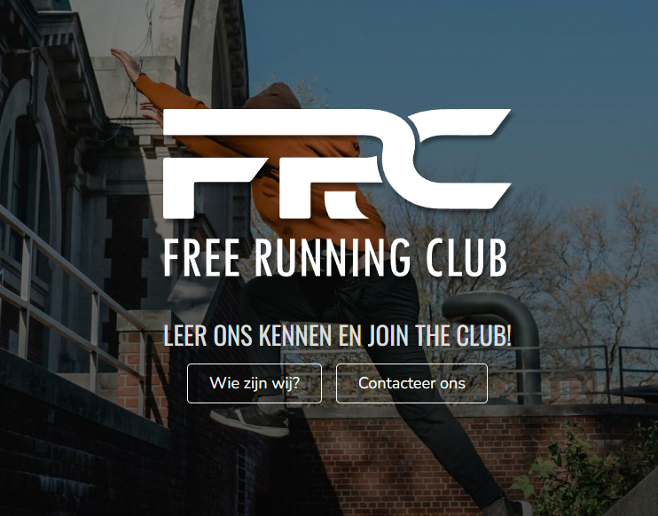

--- 
layout: base
---

# Free running club

## Description
In the subject "Project PHP," we were tasked with developing a Web application based on the analysis and design report we had previously created for Free Running Club. This club, which operates in four locations, was struggling with several administrative challenges, such as unclear registrations, confusing communications, and inefficient processing of volunteer reimbursements. Our goal was to create a responsive Web application that would solve these problems and ease the administrative burden. To do this, we used Laravel, a PHP-based framework.
The web application includes features that streamline the registration process by supporting online payments and automatic registration. Training schedules are managed centrally and members receive automatic notifications via WhatsApp message in case of changes or cancellations. The application provides streamlined processing of volunteer reimbursements for trainers. This solution improves administrative efficiency, reduces carbon footprint through reduced paper consumption, and provides a reliable communication experience for members. With the introduction of this web application, Free Running Club is better positioned to grow and meet the needs of its members.
## Team
- **Willem Helsen**: document lead and developer
- **Joris Van Puyenbroeck**: project lead and developer
- **Bulent Arslan**: developer

## Documentation
[Full documentation](https://wt-1-2022.netlify.app/)

## Live Website
[Free running club website](https://freerunningclub.willemhelsen.be/)

Logins:
P/L : lid@freerunningclub.be/lid
P/L : financieel@freerunningclub.be/financieel
