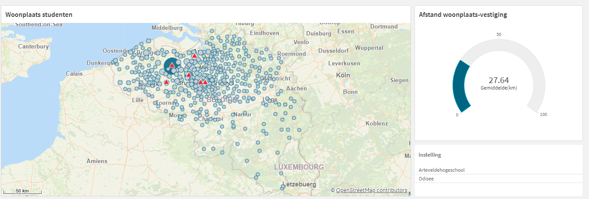
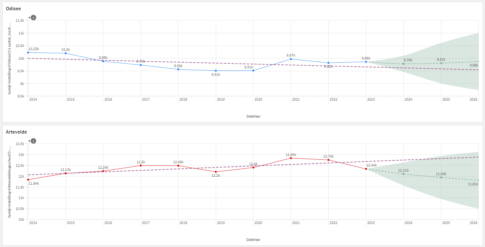
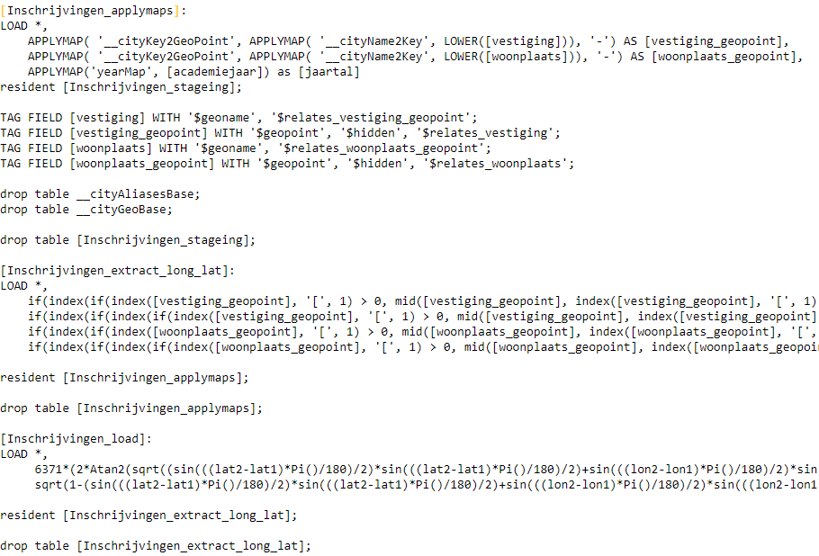

--- 
layout: project
---

# Business intelligence

## Description
To support a possible strategic alliance between the Odisee High School and Artevelde High School, a dashboard was created for the course "Business intelligence" in which enrollments, students and courses can be compared.
## Team
- **Joris Van Puyenbroeck**: data analyst

## Images

A prediction according to SSA (singular spectrum analysis) algorithm for the enrollment figures of both institutions.

For the graph in the image at the top, I created a custom formula that calculates the distance between the geolocation of the student's home address and the campus of the program this student is attendin

