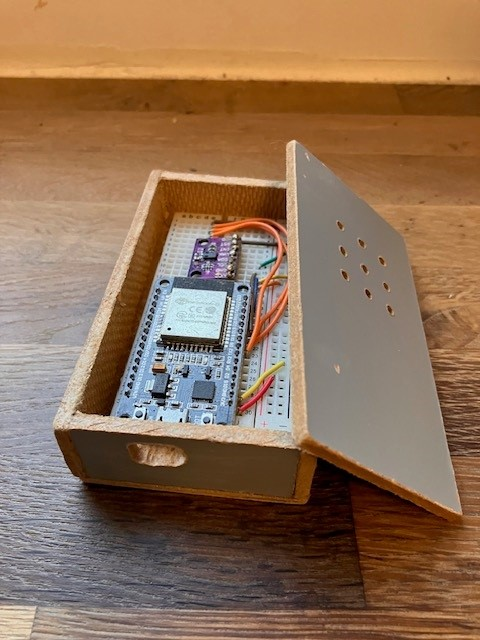
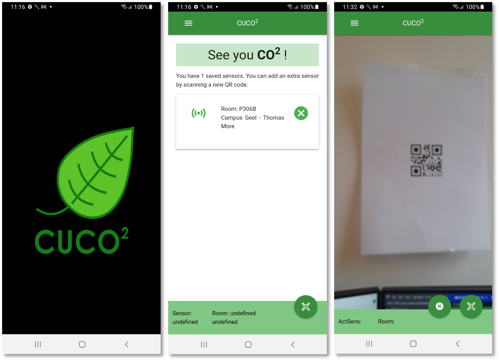
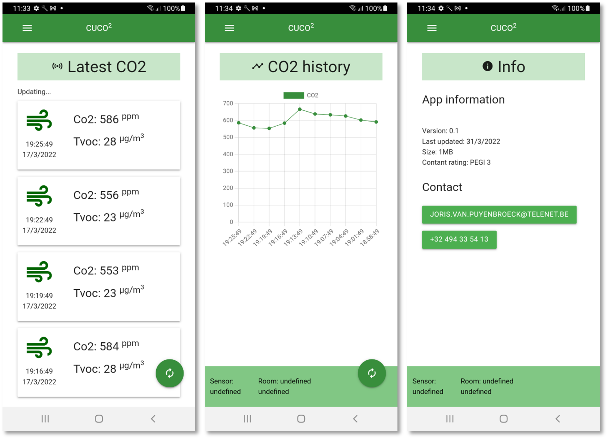

--- 
layout: base
---

# CuCO2

## Description
IoT classes call for a classic "weather station" with temperature and pressure sensor. But on my own initiative this was converted to a CO2 meter station during the Corona period with the help of a **Adafruit_CCS811** air quality sensor. The assignment in the 'Cordova' subject was to create a mobile app. I made an app that can show the results. The data is sent through an MQQT channel. The Node.Red and web server backend ran on my homelab (see other project).
## Team
- **Joris Van Puyenbroeck**: IoT enthusiast

## Images

## Documentation

Doc for the original weather station with Node-Red and web server backend can be found [here](Individual project IT essentials_Joris_Van Puyenbroeck_1ITF_rev160321.pdf)
