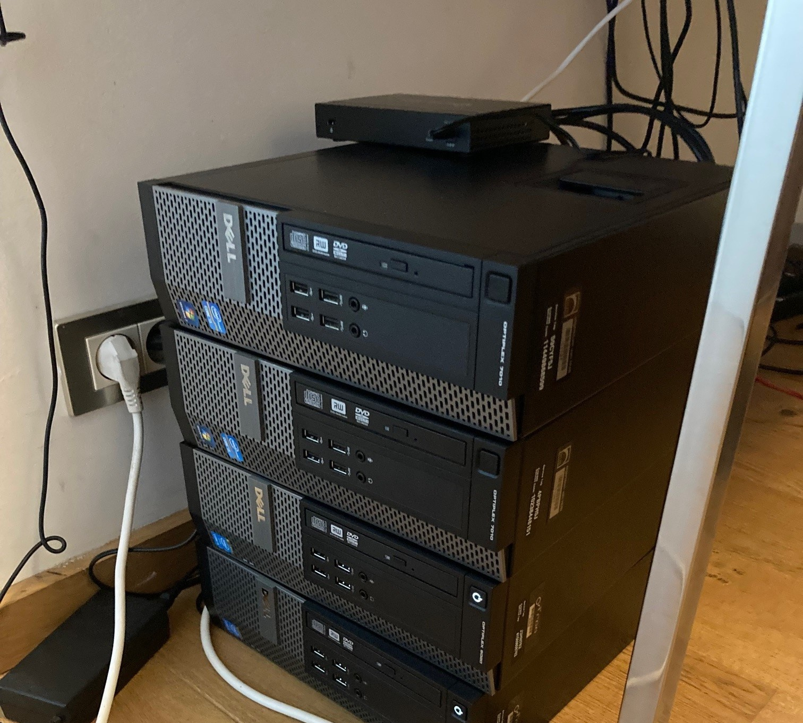

--- 
layout: project
---

# Homelab

## Description
After linux classes, I was itching to get started with a "homelab" : a cluster of PCs that together could host my future projects. I reclaimed old desktop PCs, added memory and disk space, and opted for a Proxmox setup running several windows and linux virtual machines. The cluster at one point ran my own DNS and Active Directory server for my home network.
## Team
- **Joris Van Puyenbroeck**: Linux enthousiast

## Images

