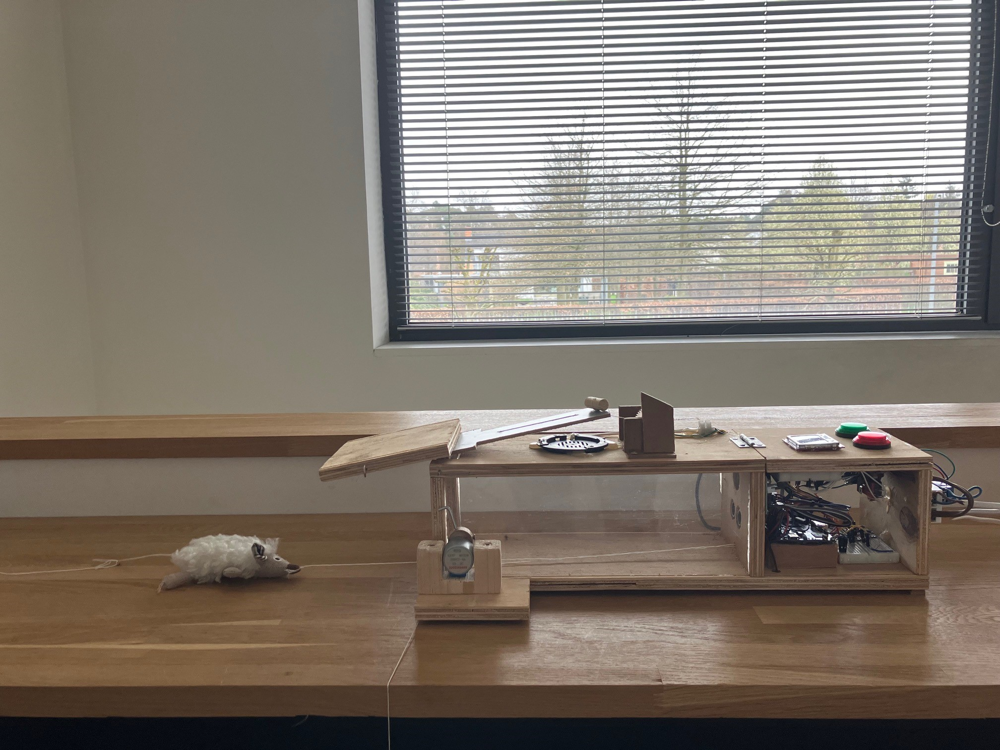
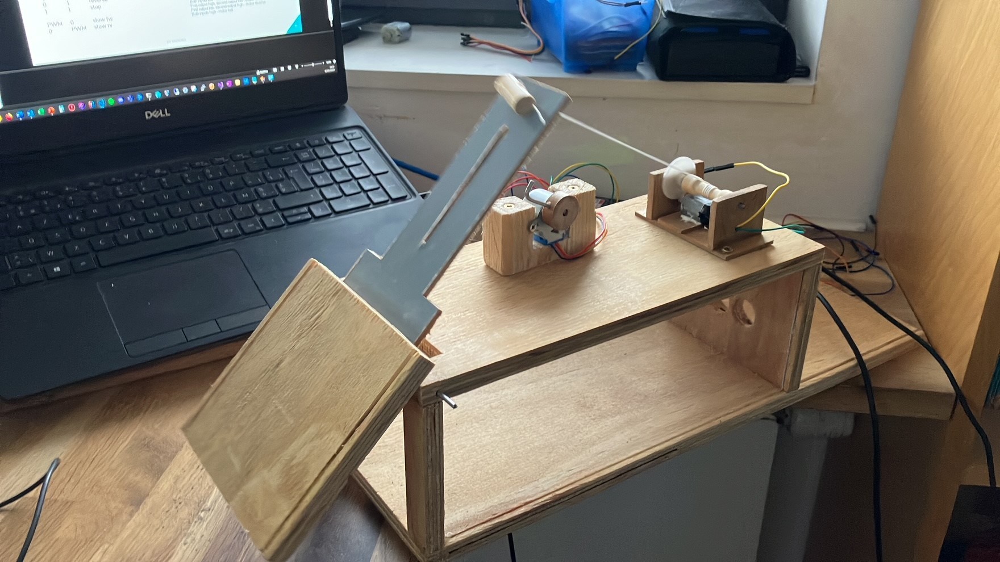
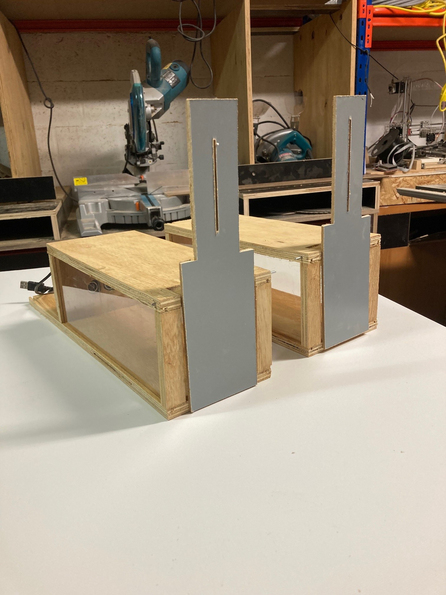

--- 
layout: project
---

# IoT Mousetrap

## Description
For IoT, we had to make a mousetrap with all kinds of sensors and actuators. A distance sensor, light sensor, step motor, DC motor, an orange pi combined with arcade buttons , a lcd display , python with AI machine learning in it, and many many many hours of work, produced a nice result.
And, as a bonus, I was able to practise some woodworking skills.
The python script cycles through different modes, and uses a lightweight tensorflow (tflite) to recognise a mouse and to trigger the trap. . 
I ran Home assistant on my Synology a the time. HA communicated with a php script on the Orange Pi. 

## Team
- **Joris Van Puyenbroeck**: carpenter and IoT enthousiast

## Images or Videos

<iframe width="560" height="315" src="https://www.youtube.com/embed/qPPL8Nrp0o0?si=iieLr_NIAS3pRkVl" title="YouTube video player" frameborder="0" allow="accelerometer; autoplay; clipboard-write; encrypted-media; gyroscope; picture-in-picture; web-share" referrerpolicy="strict-origin-when-cross-origin" allowfullscreen></iframe>

Several iterations went into this build. In this picture, an early version, where the step motor released the trap. I eliminated that by controlling the winding of the cord with the DC motor so, that it would hold the trap door on its own.
The step motor was later used to lock the door.

The carpentry needed for this project was a nice challenge. I had to make sure the trap door would fall down when the trap was triggered. The trap door was made from a piece of wood, and the rest of the trap was made from plexiglass.
And while i was at it, why not just make two ? ;-)

## Documentation

[Full report](project Muizeval Joris Van Puyenbroeck 3WT.pdf)

