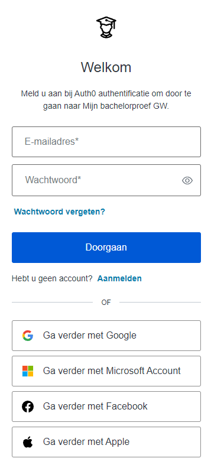
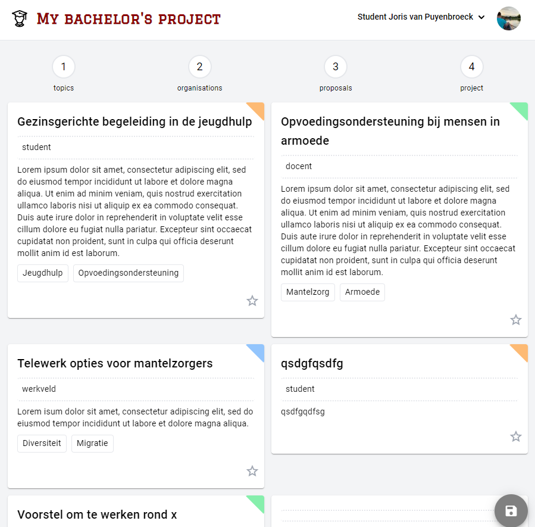

--- 
layout: project
---

# My bachelor's project

  <iframe style="position: absolute; top:0; left: 0; width: 100%; height: 100%;" src="Joris_Van_puyenbroeck_Angular_MyBachelorproject.mp4" frameborder="0" allow="accelerometer; autoplay; clipboard-write; encrypted-media; gyroscope; picture-in-picture" allowfullscreen></iframe>

## Description
As an instructor, one of my responsibilities is to coordinate undergraduate tests. The current procedure involves a lot of administration. The intention of 'My bachelor's project' is a 'proof of concept' to create a common gateway to the bachelor's thesis data for all actors (students, supervisors, mentors and administrative staff).
From topics, students can choose proposals from supervisors and link them to an organization in the field. In this way, the unique project is born, only to make its way through the procedure.
The emphasis in this project was on a backend secured via Auth0 and role based access (RBAC), and a user-friendly frontend for all actors, written in Angular. External identity providers like Google and Facebook are supported.

## Team
- **Joris van Puyenbroeck**: full stack developer

## Secure login via Auth0
The backend needed to be secured via Auth0.

The frontend has a minimal layout, with a custom 'paper' theme.

## Code

The code for the backend can be found <a href="https://github.com/jorisvanpuyenbroeck/BPGezinswetenschappen" target="_blank">here</a>.

The code for the frontend can be found <a href="https://github.com/jorisvanpuyenbroeck/tm-angular/tree/main/mijnbachelorproef" target="_blank">here</a>.
