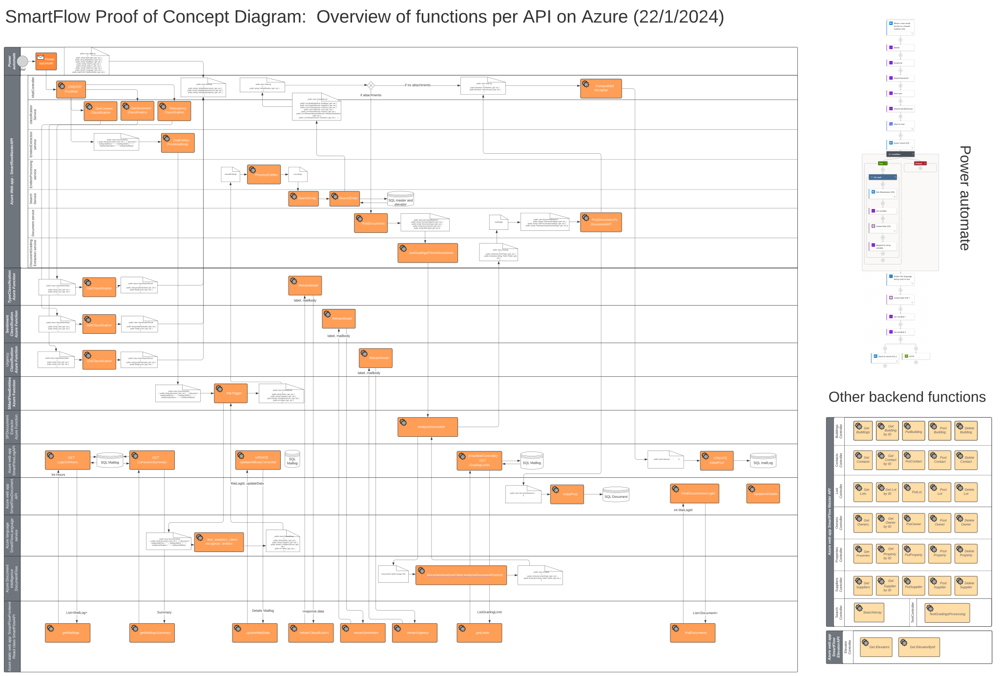

--- 
layout: project
---

# Smartflow

## Video

  <iframe style="position: absolute; top:0; left: 0; width: 100%; height: 100%;" src="https://www.youtube.com/embed/SNO6djSCd50" frameborder="0" allow="accelerometer; autoplay; clipboard-write; encrypted-media; gyroscope; picture-in-picture" allowfullscreen></iframe>

## Description
This project, handed to us by Software developer company Zeron, involved the development of an advanced system capable of processing incoming emails. The shared vision was that the system would create log items per email received, extract attached documents and classify and validate them as expense reports, invoices, certificates or inspection reports.
Our team rose up to the challende and we made 'Smartflow' with an AI that analyzes the text of the e-mail, identifies relevant information in the relational database, assesses the sentiment and urgency of the message.
Smartflow then logs the processing of the e-mail, classifies the entire e-mail as financial, technical, legal or general, suggests handling suggestions and records tickets in the database.
Besides being the project lead, I set up the database, coded the master service and helped experimenting with the AI.
Willem coded the frontend and was a superb document lead, Maarten gave us the most innovate ideas, straight from Microsoft and the Chronos group. Peter helped with the database and the backend. Many thanks for the hard work!

## Team
- **Joris Van Puyenbroeck**: developer and project lead
- **Willem Helsen**: developer and document lead
- **Maarten Willoqué**: developer and AI/Azure expert
- **Peter Henskens**: developer and data manager

## Documentation

I made this diagram to show the flow of the backend. It shows how the different services interact with each other and how the data flows through the system.

Full documentation can be found <a href="https://project40.netlify.app/intro/" target="_blank">here</a>.

