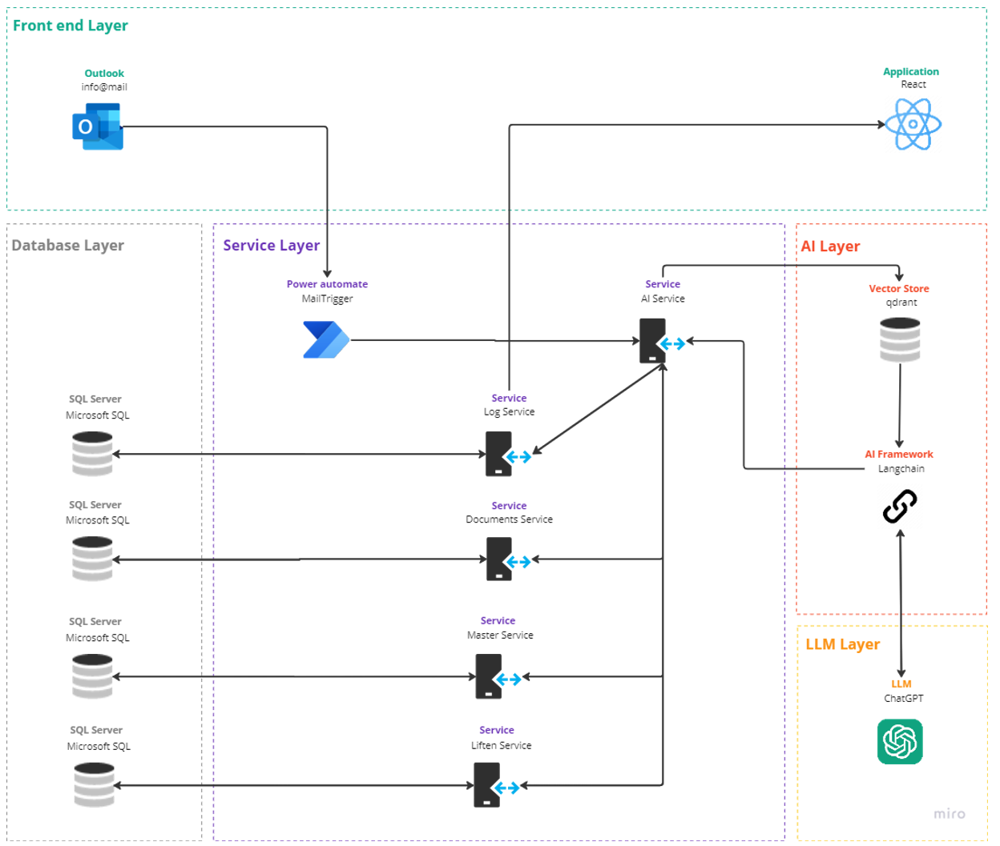

--- 
layout: project
---

# Smartflow

## Video

## Description
This project involves the development of an advanced system capable of processing incoming emails. The system creates log items per email received, extracts attached documents and classifies and validates them as expense reports, invoices, certificates or inspection reports.

In addition, the AI analyzes the text of the e-mail, identifies relevant information in the relational database, assesses the sentiment and urgency of the message.

The system then logs the processing of the e-mail, classifies the entire e-mail as financial, technical, legal or general, suggests handling suggestions and records tickets in the database.

Translated with DeepL.com (free version)

## Team
- **Joris Van Puyenbroeck**: developer and project lead
- **Willem Helsen**: developer and document lead
- **Maarten Willoqué**: developer and AI/Azure expert
- **Peter Henskens**: developer and data manager

## Images 

### Backend

## Documentation
Full documentation can be found [here](https://project40.netlify.app/intro/).

