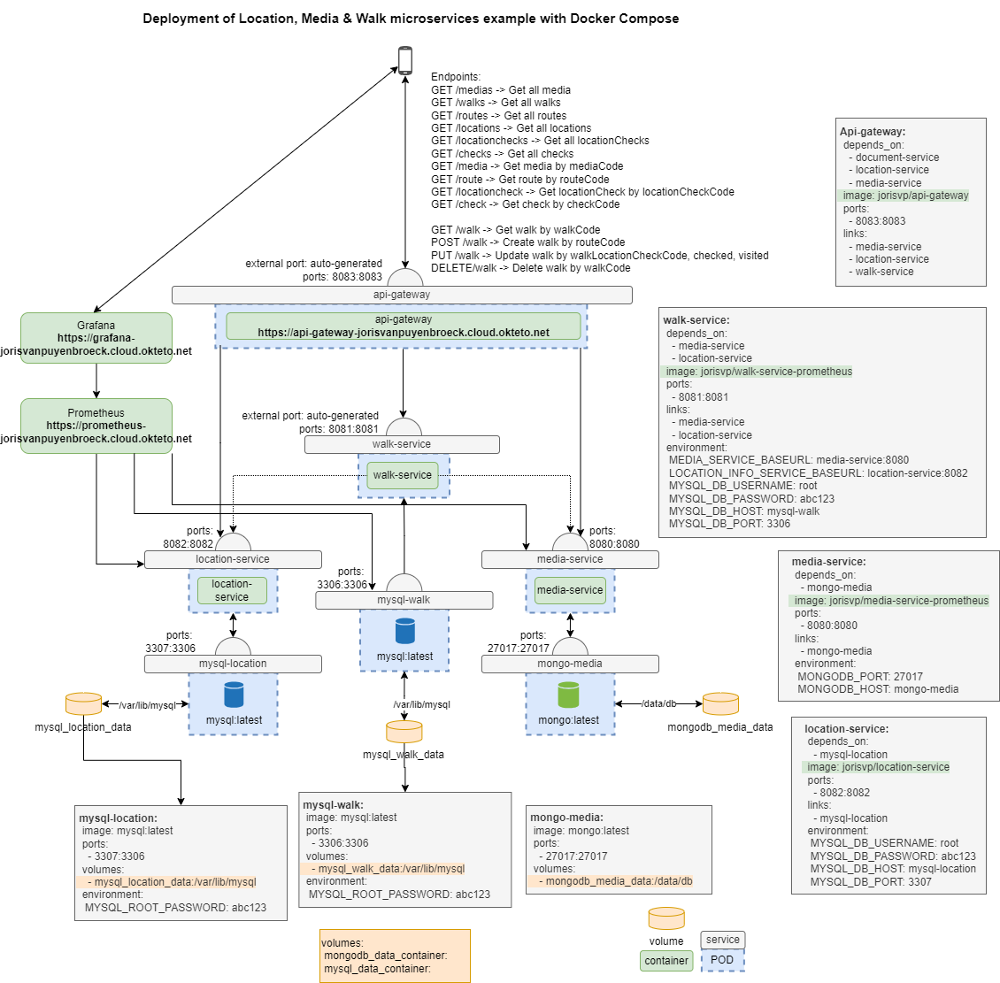

--- 
layout: project
---

# Smartpatrol

  <iframe style="position: absolute; top:0; left: 0; width: 100%; height: 100%;" src="https://www.youtube.com/embed/CSnN-jPZB6c" frameborder="0" allow="accelerometer; autoplay; clipboard-write; encrypted-media; gyroscope; picture-in-picture" allowfullscreen></iframe>

## Description
The idea for the development of the SmartPatrol app arose from the need to organize control walks for guards more efficiently. In the modern world of security and surveillance, where accurate control of locations and items is critical, we saw an opportunity to use technology to improve this process.
The SmartPatrol app was designed with the goal of enabling guards to easily and structurally check that specific items from a locations meet certain requirements. The app includes multiple predefined routes, each with a set of locations to be checked.
A key feature of the SmartPatrol app is the integration of Augmented Reality (AR) technology. This allows a guard to use their smartphone camera to recognize and validate check items. This innovative feature allows guards to quickly and accurately indicate whether they have visited a specific location and whether it meets the required standards.
This project aims not only to improve security checks, but also to increase the overall efficiency of surveillance operations. The SmartPatrol app is a promising initiative that will lead the security sector into a new era of advanced technology and precision. It will enable guards to perform their duties more effectively, thereby better ensuring the safety of locations and items

## Team
- **Joris Van Puyenbroeck**: backend (java), prometheus and grafana perfectionist
- **Willem Helsen**: frontend (flutter) and wikitude magician (and perfectionist)

## Backend

I made this diagram of the microservices in the backend. It shows how the different services interact with each other and how the data flows through the system.

## Documentation
Full documentation can be found [here](https://clever-churros-6941e3.netlify.app/)
