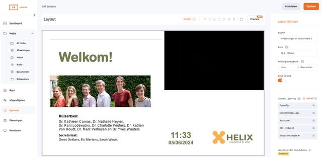
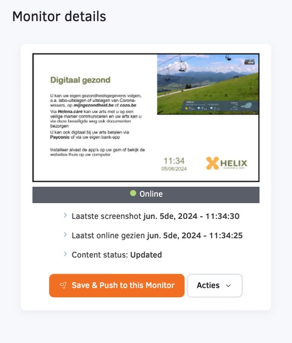
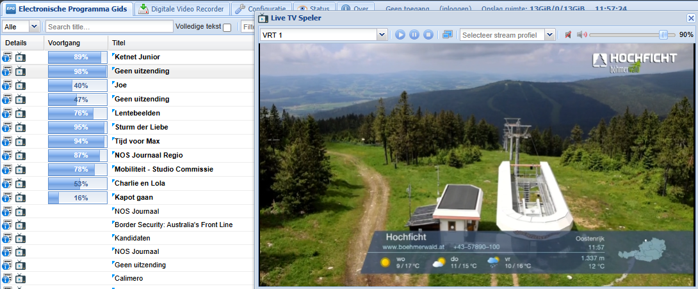

--- 
layout: project
---

# Homelab

## Description

For a doctor's waiting room, I configured  a custom digital signage TV screen with Yodeck, so that a powerpoint as well as live TV can be displayed to the waiting patients. 
Digital TV provider Telenet provides customers with no options to display streams screen-in-screen. I configured a TV Headend server on a Raspberry Pi with a DVB-C tuner to stream state television (a free channel) to the Yodeck player.

## Team
- **Joris Van Puyenbroeck**: Rasberry Pi and Yodeck enthusiast

## Images

